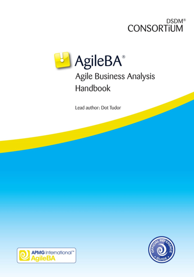
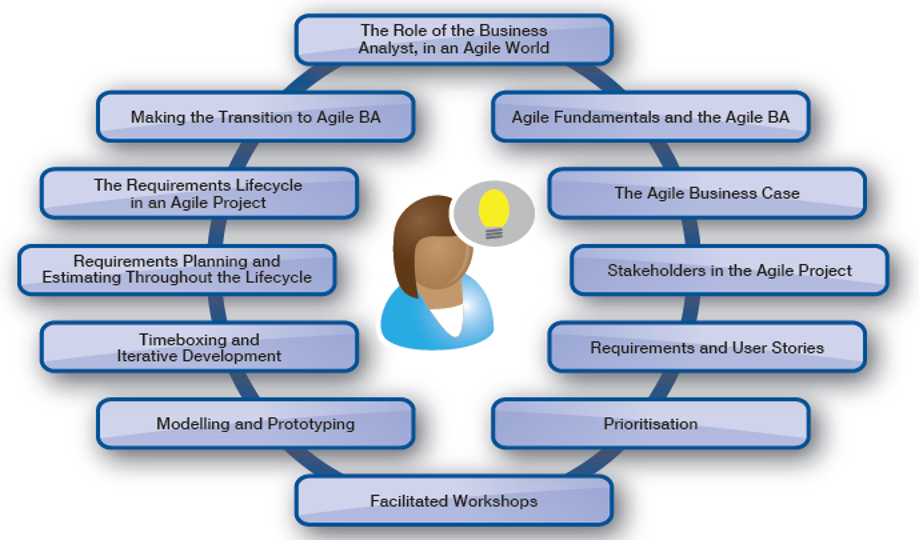

<!SLIDE center subsection>

# AgileBA®

© The APM Group Ltd 2016. This document is not to be reproduced or re-sold without express permission from The APM Group Ltd. <b>AgileBA® </b>is a registered trade mark of Dynamic Systems Development Method Ltd. The APMG-International Swirl AgileBA Device is a trade mark of APM Group Ltd.
<b>Foundation and Practitioner Vanilla Training Materials</b>

<!SLIDE bullets incremental>

### Welcome
Introductions
Name
Background
Objectives from the course

<!SLIDE bullets incremental>

### Course Objectives
To enable delegates to:

* Understand <u>the role </u>of the Business Analyst in an Agile world

* To prepare for the AgileBA exams

  * Foundation exam format:

    * 50 questions, 40 minutes, 25 marks to pass                               (50% pass)

    * Closed Book

  * Practitioner exam format:

    * 4 questions, 80 question items, 2.5 hours, 40 marks to pass      (50% pass)

    * Open Book

<!SLIDE>

### Agile BA Handbook

<!SLIDE>

